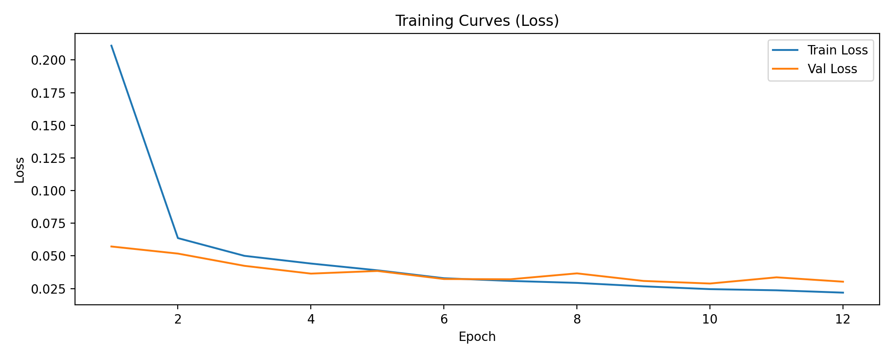
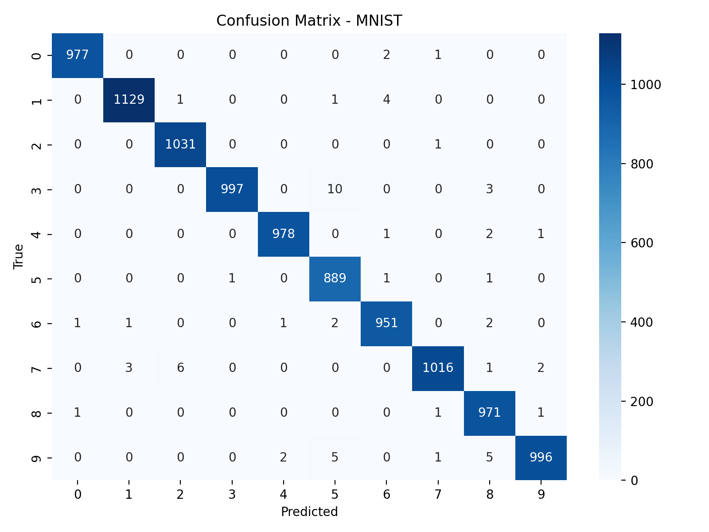
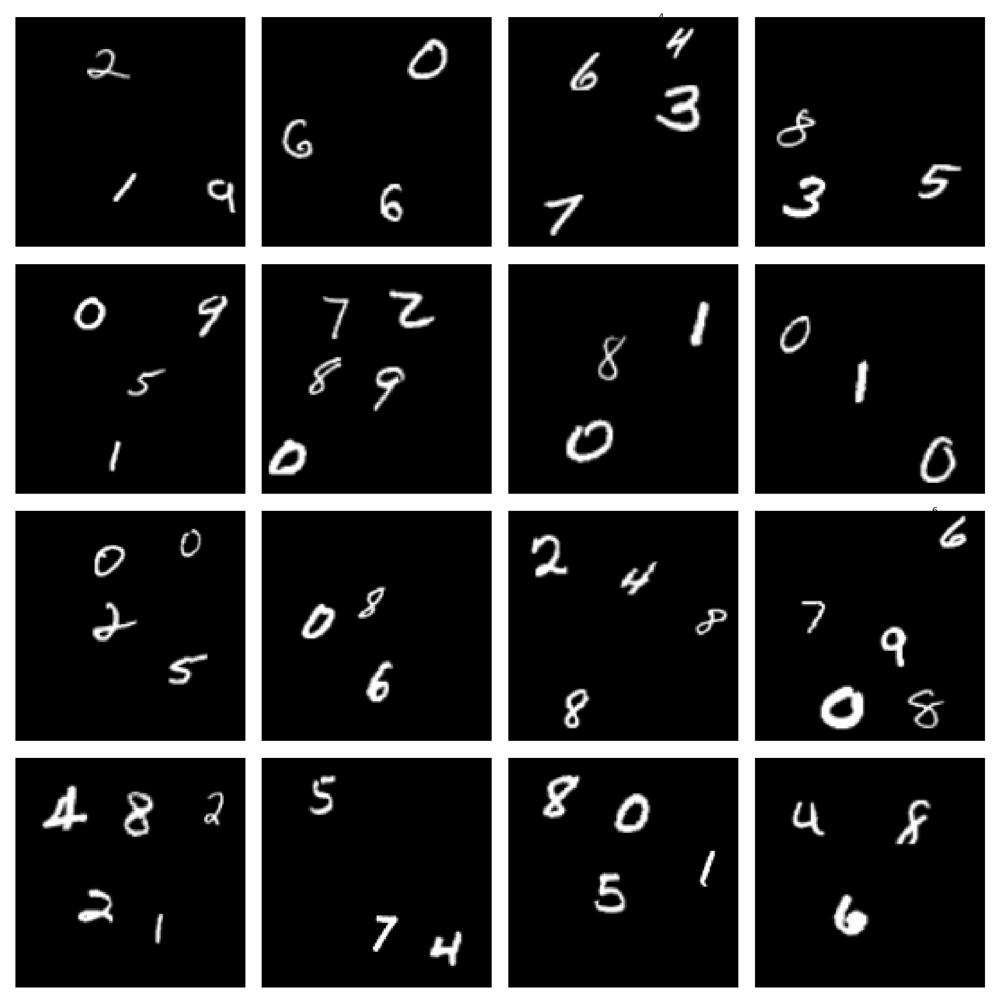
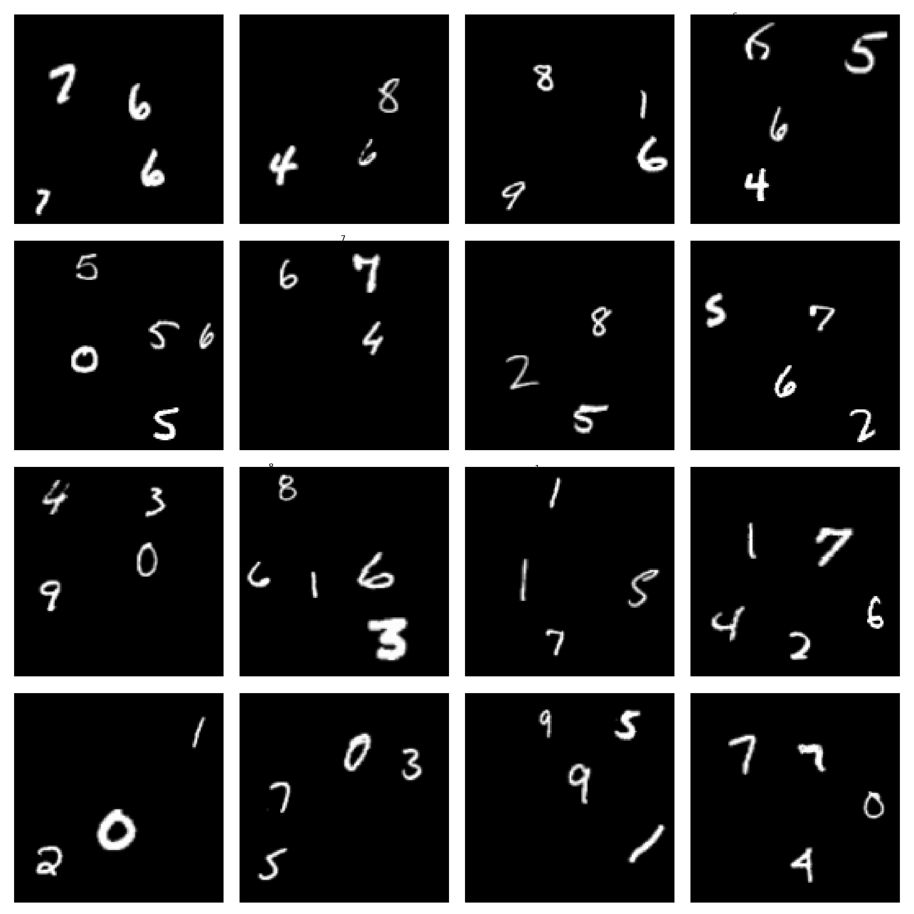
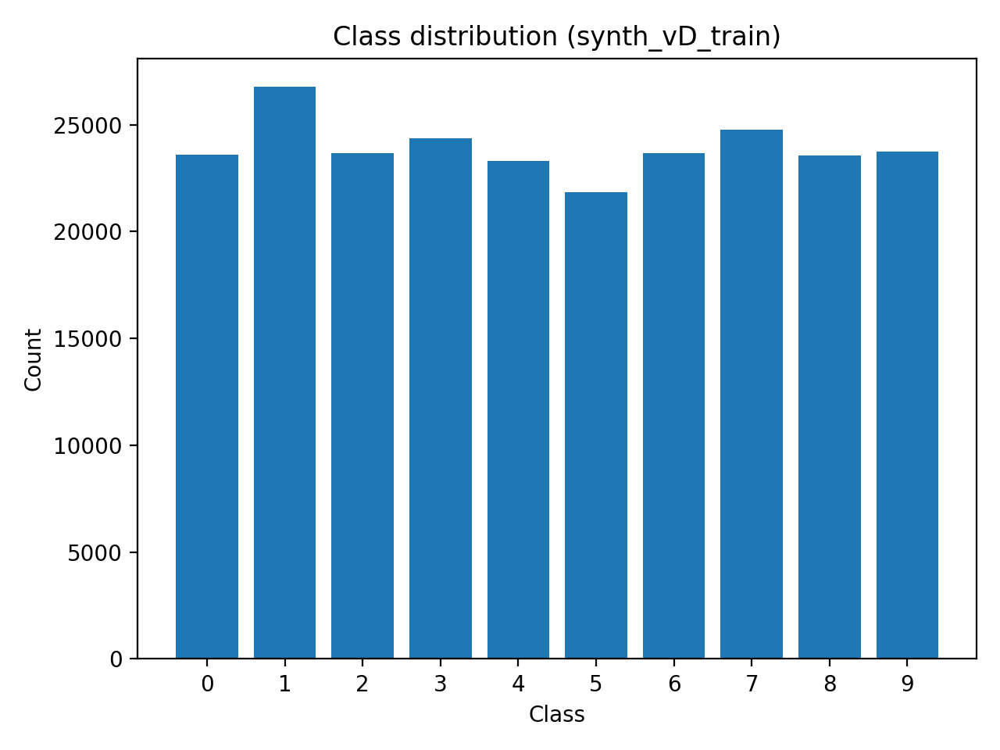
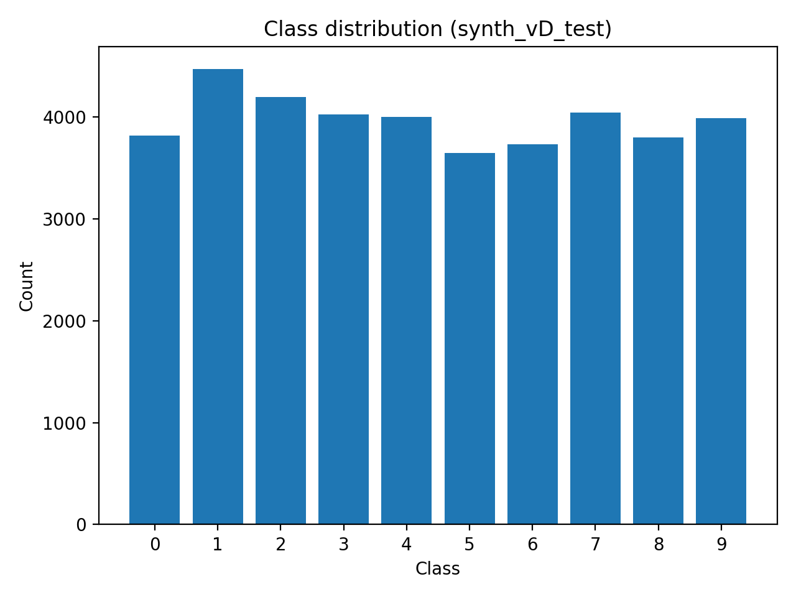
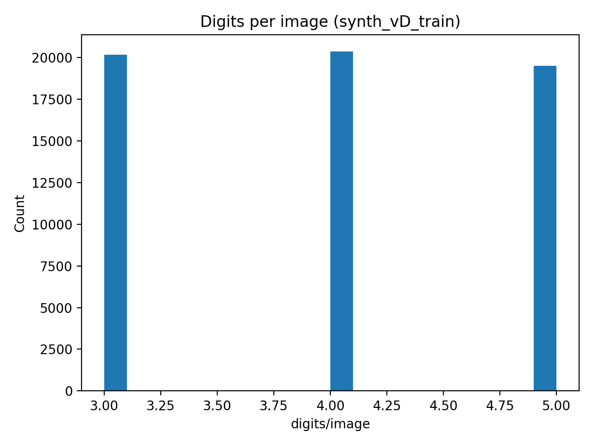
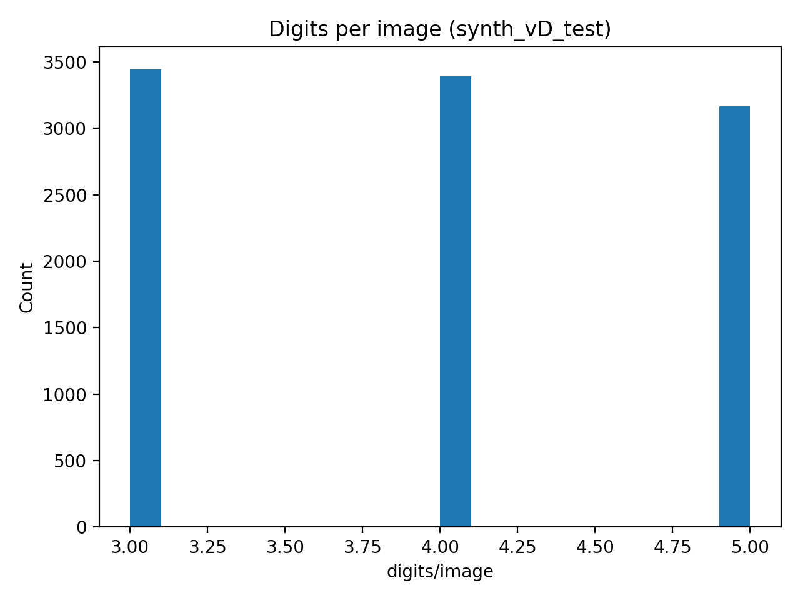
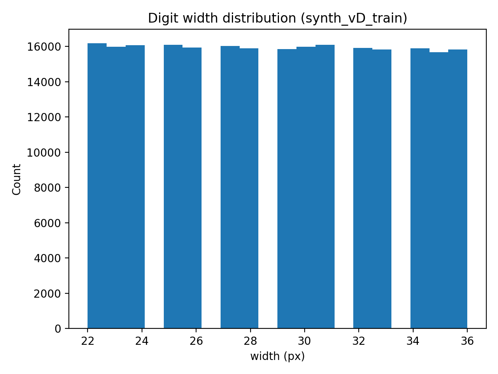
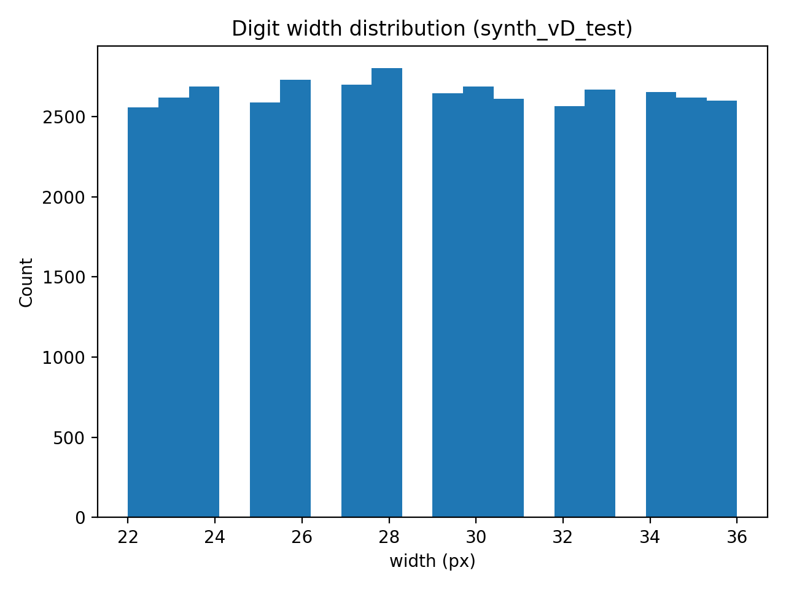

# SAVI — Deteção e Classificação de Dígitos Manuscritos

# Pascoal Mandinge Gime Sumbo - 123190

Este projeto implementa um pipeline incremental de **Visão Computacional e Deep Learning** aplicado ao problema da **classificação e deteção de dígitos manuscritos**, evoluindo desde o dataset MNIST clássico até imagens sintéticas contendo múltiplos dígitos.

O trabalho está organizado em quatro tarefas principais:

- **Task 1**: Treino e avaliação de um classificador CNN no dataset MNIST completo, incluindo métricas avançadas como matriz de confusão, precisão, revocação e F1-score.
- **Task 2**: Geração de um dataset sintético de imagens contendo múltiplos dígitos, com respetivas *bounding boxes* (ground truth), inspirado em ferramentas de deteção de objetos.
- **Task 3**: Implementação de uma abordagem baseline de deteção baseada em *sliding window*, reutilizando o classificador treinado na Task 1.
- **Task 4**: Abordagem melhorada de deteção, recorrendo ao re-treino da rede com uma classe adicional de *background*, permitindo reduzir falsos positivos e melhorar a robustez do sistema.
  
  ---

## Task 1 — Classificação de Dígitos Manuscritos (MNIST)

A Task 1 teve como objetivo o desenvolvimento, treino e avaliação de um classificador de dígitos manuscritos utilizando o dataset MNIST. Esta tarefa constitui a base de todo o projeto, uma vez que o modelo aqui treinado é posteriormente reutilizado e adaptado nas tarefas de deteção.

### Dataset

Foi utilizado o dataset **MNIST**, amplamente adotado como benchmark em problemas de classificação de dígitos manuscritos. O dataset é composto por:

- 60 000 imagens para treino  
- 10 000 imagens para teste  
- imagens em tons de cinzento com resolução de 28×28 pixels  
- 10 classes correspondentes aos dígitos de 0 a 9  

O dataset é descarregado automaticamente através da biblioteca `torchvision`, não sendo incluído no repositório, o que garante a reprodutibilidade dos resultados.

### Arquitetura do Modelo

O classificador desenvolvido baseia-se numa **Rede Neuronal Convolucional (CNN)** otimizada para o reconhecimento de dígitos. A arquitetura inclui:

- camadas convolucionais com ativação ReLU  
- normalização por *Batch Normalization* para estabilização do treino  
- camadas de *Max Pooling* para redução da dimensionalidade espacial  
- *Dropout* para mitigação de *overfitting*  
- camadas totalmente ligadas para a classificação final  

Esta arquitetura foi escolhida de forma a equilibrar desempenho e custo computacional, permitindo uma boa generalização no dataset MNIST e servindo como classificador base para as tarefas seguintes.

### Treino

O treino do modelo foi realizado com as seguintes configurações principais:

- função de perda: **Cross-Entropy Loss**  
- otimizador: **Adam**  
- divisão do conjunto de treino em treino e validação  
- seleção automática do melhor modelo com base na *accuracy* de validação  

Os principais hiperparâmetros, como número de épocas, *learning rate*, *batch size* e *dropout*, são configuráveis através de argumentos de linha de comandos.

### Curvas de Treino

As curvas de treino mostram uma convergência estável, sem sinais de overfitting significativo.

## Accuracy ao longo das épocas

## Loss ao longo das épocas

### Avaliação e Resultados

A avaliação do modelo foi realizada no conjunto de teste do MNIST, recorrendo a métricas quantitativas e qualitativas, nomeadamente:

- *Accuracy*  
- matriz de confusão  
- *Precision*, *Recall* e *F1-score* (médias macro)  

#### Resultados Quantitativos

| Métrica | Valor |
|------|------|
| Accuracy (teste) | 0.98 |
| Precision (macro) | 0.98 |
| Recall (macro) | 0.98 |
| F1-score (macro) | 0.98 |

Os resultados obtidos demonstram uma elevada capacidade de generalização do classificador, com erros residuais maioritariamente associados a dígitos visualmente semelhantes.

#### Matriz de Confusão

A figura seguinte apresenta a matriz de confusão obtida no conjunto de teste do MNIST. Observa-se uma forte concentração dos valores na diagonal principal, indicando um elevado desempenho do classificador em todas as classes.

Os resultados confirmam que o classificador apresenta desempenho robusto e generaliza bem para dados não vistos.
O modelo treinado nesta tarefa é reutilizado diretamente na **Task 3** como classificador base e serve como ponto de partida conceptual para a abordagem melhorada desenvolvida na **Task 4**.

---
##  Task 2 — Geração de Dataset Sintético para Deteção de Dígitos

### Objetivo
O objetivo da **Task 2** foi gerar um **dataset sintético de imagens maiores** contendo múltiplos dígitos MNIST posicionados aleatoriamente, inspirado na ferramenta *MNIST Object Detection*.  
Este passo permite a transição de um problema de **classificação simples** para um problema mais realista de **deteção de objetos em cenas complexas**.

### Descrição do Dataset Gerado
Cada imagem sintética possui dimensão **128×128 pixels**, fundo negro, e contém **um ou vários dígitos MNIST** colocados em posições aleatórias.  
Para cada imagem são gerados:
- a imagem (`.png`);
- ficheiros de anotações com **bounding boxes (ground truth)**;
- divisão explícita em **conjunto de treino** e **conjunto de teste**.

Foram geradas várias versões do dataset (`synth_vA` a `synth_vD`), com níveis crescentes de complexidade:
- Versão A: 1 dígito por imagem, sem variação de escala

- Versão B: 1 dígito por imagem, com variação de escala

- Versão C: múltiplos dígitos por imagem (3 a 5), sem variação de escala

- Versão D: múltiplos dígitos por imagem (3 a 5), com variação de escala

### Visualização dos Mosaicos
A figura seguinte apresenta exemplos de imagens sintéticas geradas, evidenciando múltiplos dígitos distribuídos espacialmente na mesma imagem.

Estas visualizações confirmam a existência de cenários visualmente complexos e realistas para tarefas de deteção.

### Distribuição de Classes
A distribuição das classes foi analisada para garantir equilíbrio entre os dígitos no dataset sintético.

Observa-se uma distribuição aproximadamente uniforme das classes 0–9, evitando enviesamentos no processo de treino.

### Número de Dígitos por Imagem
Foi analisado o número de dígitos presentes em cada imagem, permitindo caracterizar a complexidade das cenas.

Estas estatísticas demonstram que as imagens contêm múltiplos objetos por cena, tornando o problema significativamente mais complexo do que o MNIST clássico.

### Tamanho Médio dos Dígitos
A variabilidade do tamanho dos dígitos foi analisada através da área das bounding boxes.

Esta diversidade de escalas obriga os métodos de deteção a serem robustos a variações de dimensão e localização.

### Análise Crítica
A geração deste dataset constitui um passo fundamental no trabalho, pois:
- introduz **contexto espacial**;
- adiciona explicitamente o conceito de **fundo**;
- cria condições realistas para avaliar métodos de deteção baseados em **janelas deslizantes** (Task 3);
- prepara o treino de arquiteturas mais avançadas com classe *background* (Task 4).

Embora inspirado na ferramenta MNIST-ObjectDetection, o dataset foi adaptado ao fluxo específico deste projeto, mantendo controlo total sobre os parâmetros de geração.
A escala dos dígitos foi limitada a um intervalo entre 22×22 e 36×36 pixels, conforme sugerido no enunciado. Ao contrário da ferramenta MNIST-ObjectDetection original, onde é permitida alguma sobreposição controlada através de Intersection over Union (IoU), neste trabalho foi imposta a não sobreposição entre dígitos. Embora esta escolha torne o problema ligeiramente menos complexo do que cenários reais, ela permite uma análise mais controlada e adequada a um contexto didático.

A **Task 2** permitiu criar um dataset sintético robusto e bem caracterizado, essencial para:
- avaliar as limitações da deteção por *sliding window*;
- justificar a necessidade de arquiteturas integradas mais eficientes.

Este dataset constitui a base experimental para todas as tarefas subsequentes.

